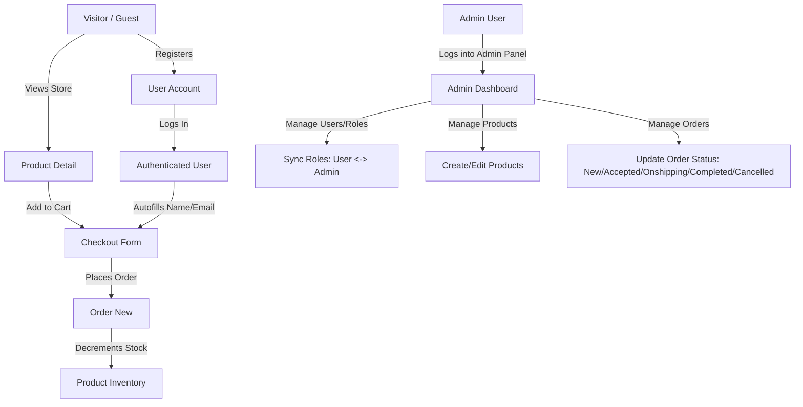

# School Homework Project

This is a web application project built for school homework, utilizing the powerful PHP framework Laravel.

## 🚀 Tech Stack

- **Backend:** PHP 8.x, Laravel
- **Frontend:** HTML, CSS, JavaScript (TailwindCSS / Vite)
- **Database:** SQLite / MySQL / PostgreSQL (Configure in `.env`)
- **Testing:** Pest / PHPUnit

## 📋 Prerequisites

Before you begin, ensure you have the following installed on your machine:
- [PHP](https://www.php.net/downloads) (v8.2 or higher recommended)
- [Composer](https://getcomposer.org/download/)
- [Node.js & npm](https://nodejs.org/) (for frontend asset compilation)
- Database server (MySQL, PostgreSQL, or you can use the default SQLite)

## 🛠️ Installation & Setup

Follow these steps to get the project running on your local machine:

1. **Clone the repository** (if you haven't already):
   ```bash
   git clone https://github.com/Arsedy/LaravelProject
   cd LaravelProject
   ```

2. **Install PHP dependencies:**
   ```bash
   composer install
   ```

3. **Install frontend dependencies:**
   ```bash
   npm install
   ```

4. **Environment Configuration:**
   Copy the example environment file and configure it if necessary (the defaults usually work fine for local development with SQLite).
   ```bash
   cp .env.example .env
   ```

5. **Generate Application Key:**
   ```bash
   php artisan key:generate
   ```

6. **Run Migrations:**
   Create the necessary database tables. If you are using SQLite, this will create the database file for you.
   ```bash
   php artisan migrate
   ```

7. **(Optional) Seed the Database:**
   If you want to populate the database with initial/dummy data:
   ```bash
   php artisan db:seed
   ```

## 💻 Running the Application

To run the application locally, you need to start both the Laravel development server and the Vite development server (for compiling frontend assets).

1. **Start the Laravel development server:**
   ```bash
   php artisan serve
   ```
   The application will be accessible at `http://localhost:8000`.

2. **Start the Vite development server** (in a new terminal tab/window):
   ```bash
   npm run dev
   ```

### Run both together with one command

If you want a single command to start both servers, use:

```bash
npm run dev:full
```

This command starts Laravel on `http://127.0.0.1:8000` and Vite at the same time, so you only need one terminal to launch both.

## 🔐 Admin Panel Access

To access the administrative panel of the application:
- **URL**: `http://localhost:8000/admin`
- **Email**: `admin@mysite.com`
- **Password**: `12345`

## 🔄 Application Workflow Tutorial (Pipeline)

This section describes the core e-commerce workflow pipelines integrated into the application, focusing on how Users, Roles, Products, and Orders interact.



### 1. User & Role Management Pipeline
1. **User Registration:** Guests register at `/register` to become a standard customer (`user` role).
2. **Admin Verification & Assignment:**
   - Log in as the default Admin (`admin@mysite.com` / `12345`) at `/login`.
   - Navigate to `/admin/users` to view the list of all registered users.
   - Click **Edit** on a user to toggle their roles (e.g., check `admin` to promote a user to administrator).
   - *Security Guard:* Administrators are blocked from deleting their own active profile.

### 2. Product Management Pipeline
1. **Automatic Seeding:** The application seeds 9 default items (Laptops, Headphones, Cameras, etc.) during `php artisan migrate` so the store is instantly populated.
2. **Admin Controls:**
   - Admins navigate to `/admin/products`.
   - Click **Add Product** to specify Title, Category, Price, Stock, Discount percentage, and upload a custom image.
   - Updates to stock or prices are reflected instantly across the frontend.

### 3. Shopping & Checkout Pipeline (User / Guest)
1. **Product Selection:**
   - Visit the storefront `/store`.
   - Click on any product title to view its details (`/product?product_id=X`), select a quantity, and click **Add to Cart**.
2. **Checkout Processing:**
   - On `/checkout`, the billing details form requires only: **Name**, **Email**, **Address**, and **Telephone** (removed zip-code, city, and country).
   - If the user is logged in, their name and email are **automatically pre-filled**.
   - The order summary calculates discount reductions and Unit Price × Quantity totals dynamically.
3. **Database Transaction & Stock Update:**
   - On submission, the order is registered under the user's ID (or `null` if guest checkout).
   - The product's inventory stock is **automatically decremented** by the ordered quantity inside a database transaction to prevent race conditions.
   - Out-of-stock items block placement and return appropriate notifications.

### 4. Order Management Pipeline (Admin)
1. **Order Reception:** Admins visit `/admin/orders` to view all new e-commerce requests.
2. **Status Progression:**
   - Click **View Details** on an order to inspect customer info and the specific product breakdown.
   - Use the status dropdown to update the progress: `New` ➡️ `Accepted` ➡️ `Onshipping` ➡️ `Completed` (or `Cancelled`).
   - Saving updates status changes instantly.

## 🧪 Testing

To run the test suite and ensure everything is working correctly, you can use Pest (or PHPUnit):

```bash
php artisan test
```

## 📖 About Laravel & PHP

**PHP** is a popular general-purpose scripting language that is especially suited to web development.
**Laravel** is a web application framework with expressive, elegant syntax built on top of PHP. It provides a structure and starting point for creating your application, allowing you to focus on creating something amazing while it sweats the details.

Laravel takes the pain out of development by easing common tasks used in many web projects, such as:
- Simple, fast routing.
- Powerful dependency injection container.
- Expressive, intuitive database ORM (Eloquent).
- Database agnostic schema migrations.
- Robust background job processing.

## 🙌 Acknowledgements

This project is built using the following HTML/CSS templates:
- [AdminLTE](https://github.com/ColorlibHQ/AdminLTE) by [ColorlibHQ](https://github.com/ColorlibHQ).

## 🎓 Academic Information

This project is submitted as part of a school assignment.
